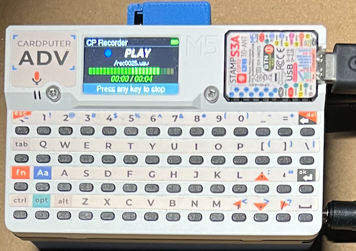

# m5cp-audio

JA

M5Cardputer-ADV を、レトロパソコン向けカセットインターフェイスの録音・再生機として使うためのソフトです。

このアプリでできること:
- カセット用音声信号を録音して WAV 保存・再生
- RMT 端子で開始/停止を制御

必要なハードウェア構成:
- 再生のみ: M5Cardputer + SD カード
- 録音も使う: PCM1808 モジュールの追加が必要です

**リリース**: 0.1.0

**M5Burner Share**: X2S7RMCggJOnHdi8

## 機能と仕様

レトロパソコンのカセットテープインターフェイス（録音・再生・リモート端子）に接続して使用します。再生だけなら PCM1808 ボードは不要です。

- 44.1kHz / モノ / 16bit リニア PCM
- SD カードに WAV 形式で保存
- 入力：PCM1808 ライン入力
- 出力：M5Cardputer-adv ライン出力
- VU メーター表示
- 簡易 SD カードファイルブラウザ
- RMT 端子対応
- 設定画面（S キー）で各パラメータを変更・保存

## 準備するもの

- M5Cardputer-ADV 本体
- SD カード（WAV ファイルを保存）
- 3.5mm ステレオミニプラグ - L/R スプリッタ

録音機能を使う場合は PCM1808 モジュールを使った回路を組む必要があります。
「配線」の節を参照してください。

M5Cardputer-ADV の音声出力端子に 3.5mm モノラルプラグを刺すと音声が出力されない場合があります。この場合はステレオミニプラグによる L/R スプリッタを使用してください。出力は L チャネルに出ます。

## 配線

録音機能を使う場合は PCM1808 モジュールを使った回路を組む必要があります。
現在専用基板は用意していないので、市販の PCM1808 モジュールを配線して使用してください。

### 必要な部品

- PCM1808 モジュール
- 3.5mm モノラルジャック（録音単子用）
- 2.5mm ジャック（RMT 用）
- 必要に応じて電圧変換基板

### PCM1808（EXT 端子）

ピンアウトは Cardputer-ADV EXT 端子のものです。

- G3 = BCK
- G4 = LRCK
- G5 = DIN
- G13 = MCK
- GND = GND
- Vcc = Vcc

3.3V 電源が必要な PC1808 モジュールを使用する場合は、EXT 端子から供給される 5V 電源を 3.3V に変換するミニ基板への配線も必要です。

### RMT 端子

2.5mm リモートジャックに配線します。

- G6 = Tip
- GND = Ring

G6（GPIO6）は INPUT_PULLUP 設定で使用します（解放時 H、リモートスイッチ ON で L）。

## 使い方（本体キー）

### Ready 画面

- R キー / BtnA: 録音開始
- F キー: ファイルブラウザ
- S キー: 設定画面
- その他のキー: 現在ファイルを再生

### Browse 画面

- ; / . （上/下）: 選択移動
- ` （Esc）: キャンセルして戻る
- Enter またはその他キー: 選択を確定して戻る

### Settings 画面

- ; / . （上/下）: 項目移動
- , / / （減/増）: 値変更
- ` （Esc）: キャンセル（変更破棄）
- Enter またはその他キー: 保存して戻る

### REC / PLAY 中

- 任意キーで停止

## 設定項目

Settings 画面で変更・保存できる項目は以下の通りです。

- use_rmt: RMT スイッチを使うか
- spkr_volume: スピーカー音量（0-255）
- brightness: 画面輝度（10-255）

## シリアルコマンド

PC からのスクリプト制御が必要な場合、シリアルで以下のコマンドが使用できます。

- P: 再生
- R: 録音
- C: 停止
- S: 設定表示
- L: WAV ファイル一覧表示
- I: 再生中かを Y/N で返す
- M / N: RMT 使用を ON/OFF して保存
- F <fname.wav>: カレントファイル設定
- Z: リセット

## 注意事項

- SD カードのルートにある WAV ファイルのみ認識されます。
- 録音 WAV ファイルは自動的に命名されます。
- 設定画面で任意の WAV ファイルを再生用セットできます。
- 本ファームウェアではファイルの名前変更、削除、移動はできません。SD カードを PC にセットして操作するか、M5Launcher をご利用ください。

## ライセンス

[MIT License](./LICENSE)

